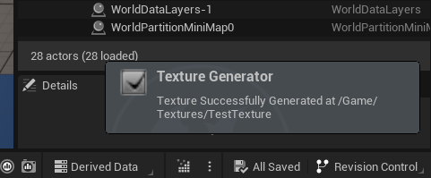

# Unreal Engine Texture Generator via OpenAI Plugin

An OpenAI (DALL-E AI) based Texture Generation Plugin for Unreal Engine 5. Developed using the Slate UI Framework.

## How it Works

> **WARNING: As of the date this file was generated, the OpenAI DALL-E API is not free! However, OpenAI provides some free credits for new accounts.**

### Step 1: Generate OpenAI API Key (if not exist)

### Step 2: Enter API Key
Enter the API key into the UE project settings, under the "Engine" tab.

### Step 3: Open the Texture Generator
The texture generator can be opened by clicking the button at the level editor toolbar.

### Step 4: Set Texture Parameters
Before generating the texture, first set the texture's size, name, and save path.

### Step 5: Generate the Texture
After entering the texture definition, you can generate the texture by clicking the `Generate` button.

After the loading ends, an informative notification will appear at the bottom right corner of the engine editor.

If the generation is successful:

If the generation failed:

### Step 6: View Log Messages (if needed)
If the generation failed, detailed log messages can be seen in the editor's `Output Log` tab.

### Step 7: Locate the Generated Texture
If the generation is successful, the generated texture can be found in the selected folder.

## Installation

This is a standard Unreal Engine 5 plugin, and can be easily installed by exporting the project to the UE `Plugins` folder.

After exporting the plugin, don't forget to generate the project file if it doesn't happen automatically.
